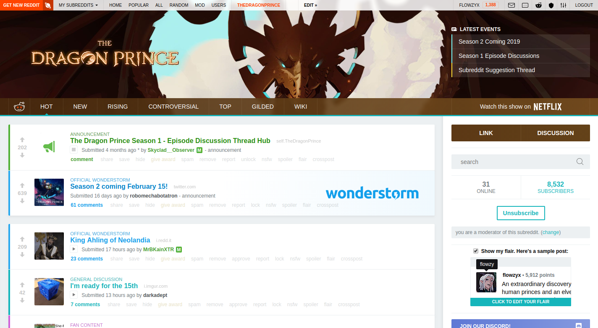

# Legacy
This is the first version of the theme for [r/TheDragonPrince](https://old.reddit.com/r/TheDragonPrince), which is no longer being maintained, as it is very close to Reddit's CSS limit of 100Kb, is buggy (because of how stuff is being moved around), and is just too messy for my liking.

If you still want to set it up, you can follow the instructions [over here](https://github.com/ncla/musereddit#development-setup) (credits to [@ncla](https://github.com/ncla)).

Here's a preview of what it should look like, when a few bugs are fixed (w/o RES enabled):

[License](https://choosealicense.com/licenses/mit/)

---

### [See maintained repository](https://github.com/flowzy/r-thedragonprince)
